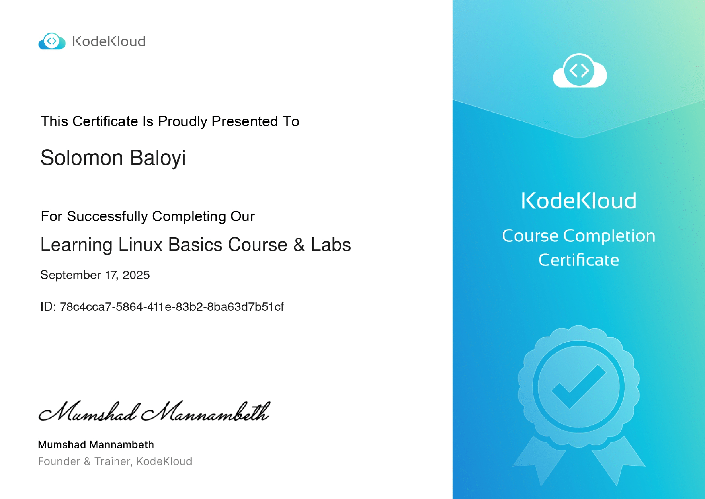

# Linux Basics — KodeKloud (Artifacts)

> Certificate & curated artifacts from the **Linux Basics with Labs** course I completed on KodeKloud (Sep 2025).

---

## 📂 What’s in this folder
- `Linux-cert.png` — KodeKloud certificate preview (click to open)
- `notes.md` — short summary of skills learned and lab highlights
- `labs/` — optional: add screenshots or short outputs from labs (e.g., `systemctl status`, package installs, logs)
- `linkedin_post.md` — ready-to-copy LinkedIn post text

---

## ✅ Suggested next steps
- Add 2–3 lab screenshots into `labs/` (e.g., `labs/systemd-example.png`).
- Fill `notes.md` with short bullet points about labs you completed.
- Post the LinkedIn text from `linkedin_post.md` and attach the `Linux-cert.png`.

