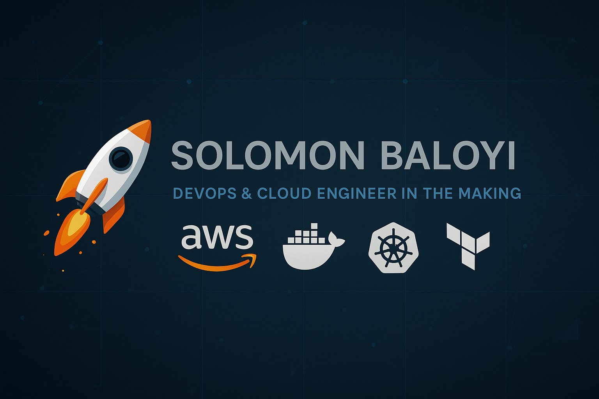

# 🔑  DevOps & Cloud Engineer in the Making
📍 Pretoria, South Africa  
📅 On a mission: 8+ certs, 10+ projects - Ready ? Here I come.  

I’m building my future—one line of code, one lab, one GitHub commit at a time.  
From AWS Cloud Practitioner to Kubernetes & Terraform, I’m documenting every step.  

---

## 🔧 Tech Stack (Learning & Building)

---

## 📓 Progress tracker
One certification / course / lab / project at a time — steady progress toward the goal.
- Current: AWS Cloud Practitioner (exam scheduled for Oct 2025)
- Learning: Python, Linux, Docker, Kubernetes, Terraform
- Projects: Resource Optimizer Agent (v0.1), CI/CD Pipeline Manager, Cost Management Bot

---

## 🎯 Goal
Land a **Junior DevOps/Cloud Engineer** role by Jan 2026 while scaling **ZiThandi Creations** on the side.  

---

## 📄 Roadmap
📥 [Cloud DevOps Roadmap 2025.pdf] [Cloud Devops Roadmap 2025 (1).pdf](https://github.com/user-attachments/files/22118418/Cloud.Devops.Roadmap.2025.1.pdf)
 

---

🔗 Connect with me: [LinkedIn](https://www.linkedin.com/in/solomon-baloyi-86b440110/) | [GitHub](https://github.com/MthunzeeBaloyi)  

# Python Basics — KodeKloud (Artifacts)

This folder contains curated artifacts for the **Python Basics** course you completed on KodeKloud.
Add these files to your `DevOps-Journey-2025` repo under `Projects/Python-Basics/`.

**What to include from this package**
- README.md (this file)
- notes.md — short summary of skills learned
- code/ — small example scripts and a sample exercise
- linkedin_post.md — ready-to-post LinkedIn copy
- commit_and_push.sh — helper script to create branch, commit, and push

**How to use**
1. From your repo root run this script to create the files, then run the included helper or do manual git steps.
